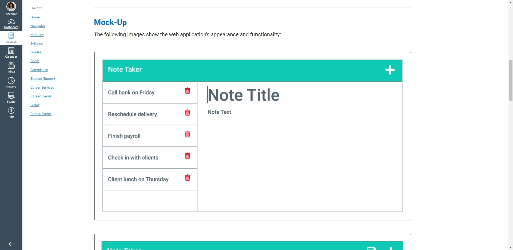
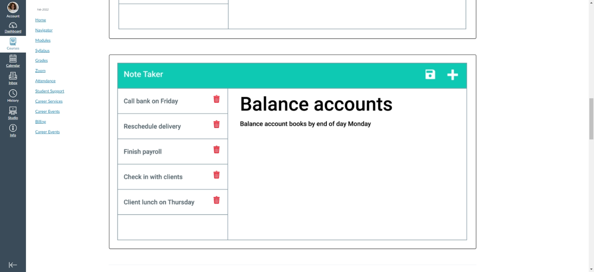

# Title

Note-Taker-On-The-Go

## Description

Create a browser based note saver and/or planner program using node.js and express.js to connect front-end and back-end coding.  The program enables a user to enter a Note title and text at the front end where, when the save icon is clicked, employs a POST Request to save the note, with a random genrated id, to an array of notes saved in a json file on the server.

## Table of Contents

* [Installation](#installation)
* [Usage](#usage)
* [License](#license)
* [Testing](#testing)
* [Credits](#credits)
* [Questions](#questions)

## Installation

type in "npm start" to run a version at [localhost:3001](http://localhost:3001) or launch on [Heroku](https://note-taker-at-work.herokuapp.com/).

## Usage

Project provides user with an online platform, accessible from any browser and/or device to save notes, appointments, reminders, etc. on the go rather than being tied to a physical note pad). A sample of how the project should appear if functioning properly was included in the [Module 11 Challenge Assignment outline](https://courses.bootcampspot.com/courses/1181/assignments/23354?module_item_id=463836), showing both the page as it appears when accessed, a list of saved notes on the left and a text area for entering notes on the  and a version of it highlighting a  being shown in the Note input section.  

## License

This application is covered under the MIT license.  [MIT license link](https://choosealicense.com/licenses/mit/)

## Contributing

Not at this time.  However, suggestions and/or feedback for how to improve functioning or add future enhancements detailed below would be more than welcome.

## Testing

No tests at this time.

## Credits

Input and assistance provided by TA's during office hour sessions and my weekly tutoring session. Various web-sites such as [Stack Overflow](https://stackoverflow.com) and [MDN web docs](https://developer.mozilla.org) put in the usual appearance.

## Questions?

If you have any questions, please see my contact details below:

## GitHub Username

My GitHub Username is github.com:lnd4812

## GitHub Repository

My GitHub repository link for this project is [Github.com/lnd4812/note-taker](https://github.com/lnd4812/note-taker)

## Future enhancements

I have not included functionality for showing a selected note in the Note Entry field or enabled the Write icon at the top of the page, but hope to be able to reattempt it when I have a better idea of how to do it.  The same applies to deleting entries.  I think I may be on the right track, but not quite there yet and would like to address other o/s items first.

## Contact information

To contact me directly, please feel free to drop me an e-mail at: <a hef="mailto:laureldavid64@gmail.com">laureldavid64@gmail.com</a>
